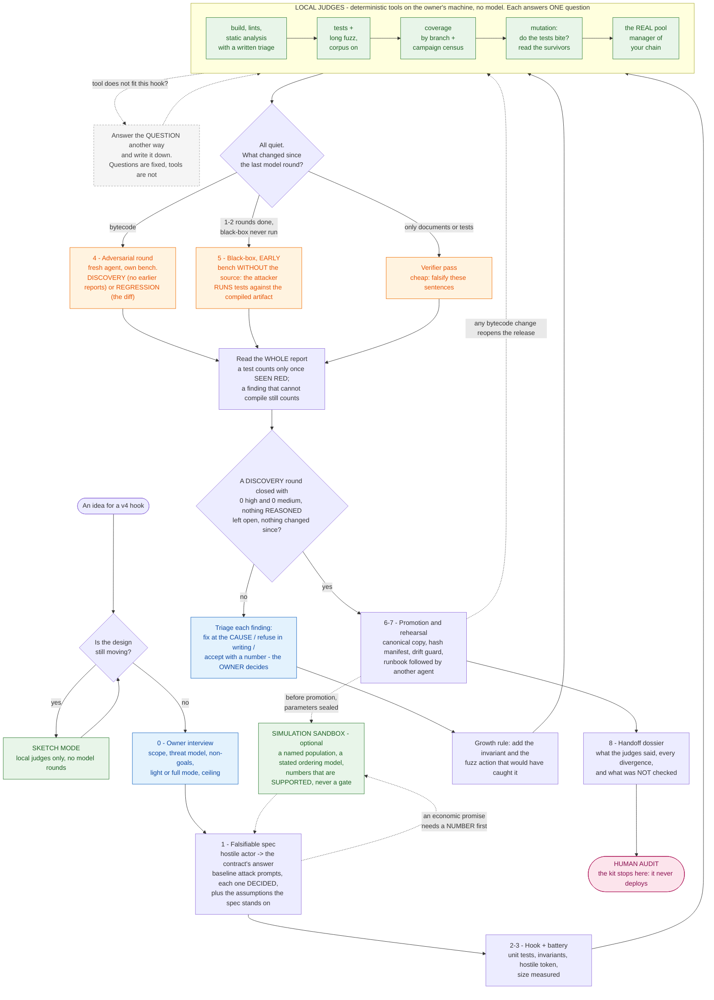

# hook-gauntlet

*From idea to audit-ready, for Uniswap v4 hooks.* Audit-ready means ready to BE audited: a human audit is the next
step, not something this repository replaces or shortens by more than the days an auditor spends asking for what a
dossier should already say.

A repository written for **agents**. You have an idea for a v4 hook, or a hook you already wrote. You give your
agent this repository and your idea. The agent walks a nine-phase route, with a gate at each phase, and the output
is a **dossier for human auditors**.

| you bring | the agent does, with this kit | you end up with |
|---|---|---|
| an idea, or a hook, and the decisions only an owner can make | interviews you, writes a spec that can be proved wrong, builds the tests, runs the local judges (fuzzing, coverage, mutation, the real pool manager of your chain), then adversarial rounds by fresh agents until one finds nothing serious | code that stopped moving, a record of every finding and every trade-off you accepted, and a dossier that tells a human auditor what was tested, how, and **what was not** |

It never deploys anything, never touches a key, and never calls a hook "safe".

> **This process does not measure security. It measures how much of your stated security model you managed to test.**
> It can be confidently wrong when that model is incomplete, when the test oracle is wrong, or when the states that
> were tested exclude the attack. The dossier it produces exists to show a human auditor exactly where the tested
> surface stops.
>
> **Validation status: measured, not validated.** Two blind runs on one small target, twelve walks of the route by
> agents that had never seen it (each on a hook nobody had seen), and a v4 module closed one area at a time with a
> second agent verifying each. All of it with one vendor's models inside one agent harness (Claude Code). Details,
> numbers and limits under *Status*.

Start at [`AGENTS.md`](AGENTS.md). Humans can keep reading here.

## Two minutes

```sh
git clone <this repository> && cd hook-gauntlet
scripts/selftest.sh              # every guard in scripts/ is made to go RED on purpose, then green. Needs forge and
                                 # foundry-kit/lib (see foundry-kit/README.md); without them it says INCOMPLETE, not PASSED
scripts/battery.sh foundry-kit   # build + tests + sizes + stale-build check on the worked example: one exit code
```

Done looks like this, on forge 1.8.1 (CI also runs 1.8.3):

```
SELFTEST PASSED: every guard went red exactly where it was supposed to.      # 376 cases, about 90 s
test      rc=0   (passed 107, failed 0, skipped 0)  ...  BATTERY PASSED           # the root kit
test      rc=0   (passed 228, failed 0, skipped 0)  suites test=10 test/examples=11 test/sim=15  BATTERY PASSED   # the v4 module, after QUICKSTART step 3
```

What the v4 module covers with a worked example, and what your project must add:

| covered by an example here | project-specific, yours to add |
|---|---|
| hooks with no delta; hooks that return deltas; native ETH pools; ERC-6909 claims; a second pool sharing a currency; settlement re-entrancy through a token; dynamic fees; per-pool reserves; price and tick edges; hostile tokens and hostile native counterparties | fork tests on the target chain; the real manager's bytecode for that chain; unusual periphery; rebasing tokens and the other token behaviours `foundry-kit/README.md` lists as not covered; who receives a payout (a JIT-recipient actor); your hook's own threat model, actions and invariants |

The ten-step version, with every command and what "done" looks like at each step, is [`QUICKSTART.md`](QUICKSTART.md).

Then, in your own project, to your agent: *"Read `AGENTS.md` in hook-gauntlet, all of it. My idea is: ... Start at
phase 0 and interview me."* From there the agent's next step comes from one decision table,
[`doctrine/NEXT.md`](doctrine/NEXT.md), and everything it decides is written in three files in YOUR repository
(`STATE.md`, `DECISIONS.md`, `LOG.md`), so a different agent - or you - can pick it up cold.

## The route, in one picture



Green runs locally: deterministic tools on your own CPU, no model involved. Orange is a round run by a model, and
spends tokens - so the table in [`doctrine/NEXT.md`](doctrine/NEXT.md) never
reaches an orange box while a green one still has something to say. Blue is the owner's decision, never the agent's.
The grey box is the rule that keeps this from being a checklist: **the questions are fixed, the tools are not**
([`AGENTS.md`](AGENTS.md) section 6b, [`doctrine/JUDGES.md`](doctrine/JUDGES.md)).

## What comes out at the end

The handoff dossier ([`briefs/handoff-dossier.md`](briefs/handoff-dossier.md)), assembled from files the route already
produced. Its sections, because they say more about this kit than any description of it:

1. **Scope sheet** - the exact commit, files in and out of scope, compiler and its known bugs, sizes, bytecode hashes,
   deployment parameters, trusted periphery, tokens supported, who holds which key.
2. **What it is and what it promises** - the hostile-actor table: what an attacker can do, what the contract answers,
   the test that proves it, the fuzz action that reaches it, the mutant that test was seen to kill. Empty cells stay empty.
3. **Access control** - every entry point, who may call it, what happens to everyone else.
4. **Known issues and accepted trade-offs** - each with a number, and who accepted it.
5. **What the judges said** - one row per tool, with the result read from its output, not from its exit code.
6. **The adversarial history** - every round, what it found, what was done about it.
7. **Where we diverged from the usual process**, and why.
8. **What was NOT checked** - the section an auditor reads first. It may not be empty.
9. **Reproduce it** - the commands that regenerate the numbers above.

## The repository, at a glance

```
AGENTS.md        the agent's entry point: the rules, the phases and their gates, when it may diverge
doctrine/        UPSTREAM (Uniswap's own docs and security framework come first) - NEXT (what do I do now?) -
                 JUDGES (eleven judges: ten deterministic tools and the simulation sandbox, the question each answers, how each one lies) - EVIDENCE - VERIFY - LOOP -
                 TRIAGE - SEVERITY - HOOK-ATTACKS - V4-ACCOUNTING -
                 INVARIANTS - FUZZ-ACTIONS - CHANGES - COST - RETROFIT - LESSONS - SIMULATE
briefs/          one template per role: owner interview, spec, audit round, black-box, verifier, executor with
                 gates, promotion, handoff dossier
state/           the three-file convention an agent installs in YOUR project
foundry-kit/     hostile ERC-20, handler base with a campaign census, reusable assertions, a worked vault
foundry-kit/v4/  harness for two pool managers (source, or your chain's real bytecode), address mining, a hostile
                 hook, a worked dynamic-fee hook
scripts/         battery - fuzz-long - census - mutate - size - bench - release-guard - assert-fresh-build -
                 install-v4 - fetch-bytecode - selftest
adapters/        claude-code (the path this was run on), codex (untested)
```

## What is in it

- **Doctrine** - the adversarial loop that makes successive audits converge instead of circling: one round at a
  time, read the whole report, fix the cause, write down the refusals, regression-test everything, re-measure.
  Plus: a decision table for "what do I do next", the eleven judges (ten deterministic tools and the simulation sandbox)
  with the question each one answers and how each one lies, what counts as evidence and how an agent fools itself, baseline prompts for things that go wrong in v4 hooks, how to derive your own invariants and fuzz actions, and when
  the agent may diverge from all of it.
- **Briefs** - parameterised templates for each role: audit round, verifier, black-box attacker, executor with
  gates, promotion, owner interview, spec, and the handoff dossier a human auditor reads.
- **A state convention** - three files in your project (`STATE.md`, `DECISIONS.md`, `LOG.md`) so an
  agent with no context can read them and continue.
- **A Foundry kit** - a hostile token mock with per-wallet switches, an invariant skeleton with a call-and-success
  census, and a worked toy example. The v4 module (`foundry-kit/v4/`) runs one suite against two pool managers - compiled from source, or the real
  bytecode of the one deployed on your chain - mines the hook address for its permission bits, and ships a small
  worked hook.
- **Scripts** - full battery, long fuzz, the campaign census (what the fuzzer actually reached, added up over every
  run), per-agent bench, publication guard, aimed mutants and variants, sizes, the pinned Uniswap sources, the real
  bytecode of the pool manager on your chain - and a self-test that makes every one of those guards go red on purpose.
- **Adapters** - a thin layer per tool. The core is plain Markdown and plain bash and depends on no vendor feature.

## What you need

Foundry, `bash`, `git`, and Python 3 if you can (standard library only: the freshness guard uses it for the evidence
it prints - which source changed since the last build; without it that evidence is missing, the verdict is forge's either
way), and an agent that can read files and run a terminal; Slither (Python) for the static-analysis
judge, which full mode requires and which is an install your agent must ask you for. `forge install foundry-rs/forge-std`
in `foundry-kit/` before the self-test (it says INCOMPLETE without it). The v4 module needs Uniswap's
sources: `scripts/install-v4.sh` fetches them at pinned commits into a git-ignored `lib/` (or, offline, copies local
clones and checks the same pins: `V4_LOCAL_SRC`, `foundry-kit/v4/README.md`). They are not in this
repository and must not be - `PoolManager` is BUSL-1.1. The scripts are exercised on Linux
and bash 5. **On Windows, run everything inside WSL** and keep the project on the Linux side: paths, line endings
(`CRLF` breaks a shell script silently) and file watchers all behave differently across the boundary. macOS is
untested.

**Hardware.** Any 64-bit machine; a slow one is only slower. Measured on an 8-core / 16-thread desktop, memory as the
peak above idle:

| step | time | memory |
|---|---|---|
| base kit: clean build / its test suite | 1.9 s / 1.2 s | 0.3 GB / 0.1 GB |
| v4 module: clean build, which compiles Uniswap's `PoolManager` with `via_ir` | 26 s | **1.3 GB** |
| v4 module: its test suite, either manager | 3 s | 0.1 GB |
| v4 module: coverage | 29 s | 1.3 GB |
| mutation of a 260-line hook, 16 parallel jobs | 1 min | **5.3 GB** |
| the same, `--mutation-jobs 1` | 30 min | 0.9 GB |
| invariant campaign, 64 000 fuzzed calls, small example | 13 s | negligible |

So: 8 GB is comfortable, 4 GB works if you keep mutation to one or two jobs, and mutation is the step that trades
memory for time almost linearly. The expensive part of this kit is not your machine, it is the model behind your
agent. On Windows, WSL sees half of the machine's memory by default.

## Who it is for

Someone who is building a v4 hook and wants it to arrive at a human audit in a state that does not waste the
auditor's time: a falsifiable spec, a green battery, a fuzz campaign, a written record of every trade-off that was
accepted and why, and a list of what was not checked.

You need a Foundry toolchain, an agent runner with a strong orchestrating model, and budget for compute.

## What this is NOT

- **Not a security guarantee.** Passing every gate means "ready for humans to audit". Nothing here certifies that a
  hook is safe.
- **Not a replacement for a human audit.** The effort this method was distilled from went through 28 revisions and
  25 adversarial rounds, and its own authors do not consider it ready without human eyes on it. That is the whole
  point of the route: it is a route *to* an audit.
- **Not an autonomous auditor.** It is a discipline for an agent working with an owner who makes the decisions.
- **Barely benchmarked.** One blind run, one audit round, one small target. See *Status* below.

## Honest costs

Compute is the real cost. Two modes:

| mode | phases 4 and 5 |
|---|---|
| **light** | 3 adversarial rounds + 1 black-box |
| **full** | rounds until a discovery round closes with zero high and zero medium findings and nothing reasoned is left open, plus a black-box round and a verifier round. Open-ended: the effort this was distilled from took 25 rounds |

**We do not publish a price**, but here is the arithmetic from the one round we metered: about 250k tokens and half
an hour per round on a 440-line hook, so a light-mode run (a ceiling of 4) is on the order of a million tokens of round
traffic, once, n = 1, before the orchestrator's own reading. We did not meter the project this was distilled from, and a kit whose first rule is
"measure, do not infer" is not going to dress that up as a price list. The ROUND line of each `LOG.md` entry records the real cost of each of
your rounds. The one number we have measured is in *Status* below.

The long fuzz campaign is the other cost, and it is CPU time, not model spend: expect tens of minutes per run.

## Limits, stated plainly

- **It depends on a strong orchestrator.** The single highest-leverage part of the method is a well-written brief
  and a full reading of each report. A weak orchestrating model produces rounds that opine instead of measuring.
- **One proof case.** This is distilled from the hardening of one real v4 hook over 28 revisions and 25
  adversarial rounds. One case is one case.
- **Shared blind spots.** Models from the same family miss the same things. The kit recommends that at least one
  round - the verifier or the black-box - runs on a model from a **different vendor**. Nothing in the kit can
  detect a blind spot that every model you use shares.
- **Agent tooling ages fast.** The adapters will rot before the doctrine does. The core is deliberately plain
  Markdown and plain bash so that it outlives them.
- **v4 hooks only.** The method generalises; this version does not. Widening it means replacing the Foundry kit.

## Prior art

This is not the first attempt to put adversarial pressure on a contract before a human sees it, and it borrows
from all of these:

- **"Weird ERC-20" repositories** - the catalogues of token behaviours that break integrations (fee on transfer,
  rebasing, missing return values, revert on zero, blocklists). The hostile-token mock in `foundry-kit/` is a
  switchable version of that idea, and the catalogues are a better checklist than anything an agent will invent.
- **DeFi CTFs and wargames** - the tradition of learning a protocol by breaking a deliberately vulnerable copy of
  it. Phase 4 is that tradition with the copy replaced by your own code.
- **Uniswap's own material, which comes first**: the [v4 developer docs](https://developers.uniswap.org/docs/protocols/v4/overview)
  and the Uniswap Foundation's [Hook Security Framework](https://developers.uniswap.org/docs/protocols/v4/security) - a
  self-scored risk tier that says how much outside assurance a hook is expected to have. The owner scores the hook in
  phase 0 and the dossier reports against it. [`doctrine/UPSTREAM.md`](doctrine/UPSTREAM.md) lists what to read before
  believing anything here, and says that where upstream and this kit disagree, upstream wins.
- **The official [`v4-template`](https://github.com/uniswapfoundation/v4-template)** - phase 2 starts from it, not
  from a layout of ours. If the template changes, follow the template.
- **Foundry's invariant testing and `forge fuzz`** - the judge in this kit is Foundry. The doctrine is mostly a set
  of rules about how to read its output honestly.
- The published audit-report conventions of the human audit firms, for the shape of a finding: severity, who
  loses, cost to the attacker, fix, and the test that proves it - and their audit-readiness guides, from which the
  dossier's "must" rows were taken (the research notes behind it are not in this repository; the guides themselves
  are a web search away and the dossier template says which rows are theirs).
- Most of this repository is packaging of those four sources for an agent. What outside reviewers agreed was new:
  the rule that a test counts only once seen red, the campaign census, "questions fixed, tools free", the mandatory
  "not checked" section, and the catalogue in `doctrine/JUDGES.md` of how each tool lies.

## Status

**v0, 2026-09-24. Two blind runs on one small target; twelve fresh-reader walks of the route, the last seven with a
real discovery round each; the v4 module's gap list closed except fork tests. One model family, one agent harness.**

| part | state |
|---|---|
| doctrine, briefs, state convention | distilled from a real project, then walked twelve times by strangers on twelve new hooks (below); every stall they hit is fixed, and each fix was re-walked |
| Foundry kit and scripts | written with their own tests (hostile token: one test per switch; guards: a self-test that makes each one go red on purpose). Scripts exercised on bash 5 / Linux only |
| v4 module | harness with both managers, address mining, three worked hooks with unit, invariant, mutant and edge tests; proven once against the Ethereum mainnet manager's bytecode. **Covered:** delta-returning hooks, native currency with a hostile native counterparty, ERC-6909 claims with conservation per party, settlement re-entrancy through a token's transfer hook, a second pool sharing a currency, tick/price/fee edges (all 2026-09-24, each area verified by a second agent - below). **Not covered:** fork tests and a block-pinned fixture; a JIT-recipient actor for hooks that pay "whoever is in range"; v4-periphery (its README, "What this module still does not do") |
| `adapters/claude-code/` | the path the method was actually run on |
| `adapters/experimental/codex/` | **experimental / untested** - written from the documented convention, kept out of the supported path until an end-to-end run exists |
| blind benchmark (planted bugs, sealed answer key, measured recall) | **run twice on the same target**: one round, then the full light route - see below |
| review of the kit itself | three audit passes, twelve fresh-reader walks, five verifier passes over the v4 series - see below. **Same model family as the authors, one agent harness; no human has reviewed this kit** |

### The kit, put through its own loop

Each pass was a fresh model instance, on a frozen tree (a manifest of hashes checked before and after), forbidden to
read the authors' notes, and told to assume the previous fixes were wrong.

Severity here is the kit's own scale for a repository of Markdown and bash: **high** = a gate that passed when it
should have failed, **medium** = a guard that could be beaten or a fix that opened a door, **low** = wording and numbers.

| pass | high | medium | low + informative | what it was mostly about |
|---|---|---|---|---|
| 1 - independent audit | 3 | 9 | 19 | **false greens in the gate scripts themselves**: a battery that passed with zero tests, a mutation script that said KILLED on any error, a long fuzz that passed with no campaign |
| 2 - verifier, over the fixes | 0 | 4 | 15 | two doors **the fixes had opened** (one script could now delete the project it was asked to copy); a "campaign census" that was really one run in 64 |
| 3 - verifier, over those fixes | 0 | 0 | 12 | the same path guard, beaten twice more by odd paths; nine sabotages the self-test did not notice |

All fixed, and since pass 2 every fix arrives with the case that sees it red first (`doctrine/VERIFY.md` 11b). The
numbers fall; they have not reached zero, and the pattern is worth more than the count: **the Solidity held, the
bash around it did not.** Anything here that parses a tool's human-readable output is the part to trust least.

### The blind benchmark, run 1

An agent wrote a ~440-line limit-order hook with six planted defects (2 high, 3 medium, 1 low), one red herring, a
spec and a green battery of 20 tests, and sealed the answer key. Two fresh agents, each alone on an isolated bench
with this kit and one brief, ran **one audit round**. Neither could see the key or the other.

| | normal audit brief | brief that reasons backwards from the harm |
|---|---|---|
| planted defects found (recall against the key) | 6 / 6 | 6 / 6 |
| findings emitted in total | 12 (6 planted + 4 beyond the key + 2 informative) | 11 (6 + 3 + 2) |
| false alarms among those adjudicated | none found; 2 of arm A's extras were not adjudicated | none found |
| red herring | dismissed, with a test | dismissed, with a test |
| real findings beyond the key, confirmed afterwards by reading the source | 1 high, 1 medium (+2 unadjudicated) | 2 high, 1 low |
| tokens / wall clock | 269k / 28 min | ~230k / ~20 min |

Read this for what it is:

- **n = 1, one small target, one round.** The spec phase, the fuzz growth loop, the black-box round and promotion were
  not exercised. The route as a whole is still unmeasured.
- **The target was too easy to separate the two briefs.** Both hit the ceiling, so the comparison is undecided.
- **Planter and auditors were the same model family.** A blind spot they share is invisible in this result.
- The planter did not know about the two extra high-severity bugs. An answer key written by a model is a floor.
- One arm built the invariant suite on its own and reported that five of its twelve findings were a missing fuzz
  *action*, not a missing invariant - which is what `doctrine/FUZZ-ACTIONS.md` says, confirmed from outside.

### The blind benchmark, run 2 - the full route, two models

Same target and sealed key as run 1. Two fresh agents entered by `QUICKSTART.md` with nothing else, played the owner,
and walked the **light route** - interview, spec review, local judges, the simulation sandbox, up to three model rounds,
the dossier skeleton - each on its own bench.

| | strong model (Opus 5.5) | cheaper model (Sonnet) |
|---|---|---|
| planted defects found | 6 / 6 | 6 / 6 |
| planted highs, rated high | 1 of 2 (one rated medium: "nobody profits") | 2 of 2 |
| red herring | not raised | not raised |
| the two real highs beyond the key (known since run 1) | both (one rated medium) | both, rated high - found by the **black-box** round, without the source |
| model rounds used, of 3 | 1 (discovery) | 3 (discovery found 3 of 6; black-box and verifier found the rest) |
| tokens | ~265k | at least ~545k (one round's usage was not returned) |
| simulation sandbox | run, shipped agents | run |

Read this for what it is:

- **The route lifted the cheaper model to the same score; the strong one needed one round of it.** That is the first
  measurement of what the route adds, and it is one run per arm.
- **The target was already scored once**, and the key was written by a model of the same family as both auditors.
- **The second arm's isolation is self-declared**: the orchestration harness gave every agent one shared scratch
  directory, and the first arm's tests were in it while the second ran. The second arm and its sub-agents declared
  they did not read it; that cannot be proved, so the result is labelled indicative. (The rule it produced is
  `doctrine/ORCHESTRATION.md` §1.)
- **A harder target was not built**: the model provider's safety classifier stopped the agent asked to write a hook
  with planted defects, twice. The next target comes from public hooks with public fixes (`ORCHESTRATION.md` §4).
- Both arms left a list of places where the kit was wrong or silent. The fixes are in the commits after this run;
  whether a fresh reader still stalls at those steps is the next measurement, not a claim made here.

### Twelve walks by strangers

After run 2, the question changed from "does an auditor find the bugs" to "does a stranger get through the route
without guessing". Each walk was a fresh agent given `QUICKSTART.md` and nothing else, on a hook it wrote for the
purpose (a capped desk, a surge-fee pool, a budget gate, an impact guard, a cooldown gate, a tip jar, a swap-reward pot,
a claims escrow, a bonded-swap gate, a milestone escrow, a referral skim, a donate-back hook - the last four real v4
hooks, the last with a delta and ERC-6909 claims on native pools), owner played from the project's files, token
behaviours left undecided on purpose. Each recorded every step as clean, guessed or stalled; the orchestrator fixed
what it named and the next walk re-walked it.

| walks | what they stalled on, in order | state after the fix |
|---|---|---|
| 2-3 | the sandbox did not compile on forge's defaults; a freshness guard red once in ten for no reason; holes in the decision table | the guard asks forge itself; the table has a row for phase 3 and for an absent owner |
| 4-5 | binding the sandbox changed the audited bytecode (1374 -> 727 B) with no flag moving | the sandbox lives in its own forge profile; measured byte-identical before and after |
| 6-9 | where the auditor's tests compile, which campaign the census gate judges, the long-fuzz budget on forge's defaults, a whole missing step (building the harness) | step 7b exists; the gate judges the long campaign and leaves a record |
| 10 | "nothing false in the tools" - three doctrine guesses | fixed |
| 11-13 | a real v4 hook has no project recipe; coverage under the manager's IR restriction measured the wrong build; a hook that pays "whoever is in range" has no recipient check | recipe in 7b; `--ir-minimum` mandatory there; class 20 names the JIT recipient - the actor is the module's next gap |

Every walk ended with "no": a stranger still had to guess somewhere. What shrank is what they guessed at - from a
sandbox that would not compile to a sentence about who counts a pending row. The last four walks reported every
script doing what its document said. No walk was on a hook anyone had seen before; no walk was on a hook that exists
in production.

### The v4 module, closed one area at a time

The module's own list of what it did not do was closed in four agent passes (deltas; native currency and claims;
settlement re-entrancy, a second pool, the edges; and the fold-ins), each followed by a verifier agent with fresh
context and its own tests, told to falsify. What the verifiers did:

- confirmed the four-orientation accounting at the wei from raw balances, the re-entry tables, the mutant tables;
- **broke one claim**: "a position of an LP that refuses ETH is stuck, not lost" - a stranger could remove it and keep
  the money, because the fixture's liquidity helper owned every position; fixed (positions per caller);
- **found what the authors had not**: forge clears transient storage between top-level calls, so a unit suite never
  sees two swaps in one transaction (a mutant survived on that alone); a token callback paying with its own claims
  bypassed a check and left a rebate as nobody's; a hook's `settle` mid-payment against a router that pays what it
  still owes is theft, visible only to books kept per party; state kept per currency let a stranger's pool drain
  another pool's rebates while conservation per currency stayed green.

The v4 battery went from 108 to 228 tests. `doctrine/V4-ACCOUNTING.md` carries the measured items (13-24) and four
rules; `doctrine/HOOK-ATTACKS.md` names the test file for every class the module exercises.

### How all of this was run, and what is next

Every agent above ran inside **one harness, Claude Code, on one vendor's models**: Opus 5.5 as the workers, verifiers
and strangers; Sonnet as the cheaper arm of run 2; Fable 5.1 deciding doctrine, reading reports, and never certifying
its own work (`doctrine/ORCHESTRATION.md`). That is the single largest limit of every number on this page: a blind spot
shared by that family and that harness is invisible here.

The next measurement is therefore **another vendor and another harness**: an open-weights model run locally inside an
agent harness of a different lineage, given this repository and a hook, with the orchestrator asking it to walk the
gauntlet as the owner would - the same score sheet as the walks above (steps clean / guessed / stalled, findings against
a sealed key). It also removes two things that shaped the runs here: a provider-side safety classifier that stopped
agents asked to author planted defects (and once a plain discovery round), and a harness that refuses report-named
files. Until that run exists, the route is measured on one family and one harness.

Until there is a run on another vendor's model and another harness, treat the claims in this repository as a
description of a method measured on one family, with the numbers above.

Issues and confirmations are useful. The most useful thing you can send is a run of the route on a hook we did not
write: the step where you stalled or guessed, the attack that was missing, the test that turned out vacuous, the mutant
that survived, and what the human auditor found afterwards. `CONTRIBUTING.md` says how; `SECURITY.md` is for a flaw in
the kit itself.

## Origin

Distilled from the hardening of one real Uniswap v4 hook across 28 revisions and 25 adversarial rounds. The project
itself is not identified, and no line of its code and none of its mechanics are in this repository. A few measurements
of TOOL COST taken on it appear in `doctrine/JUDGES.md`, marked as coming from "a real hook" (mutant counts, run times);
nothing about the contract itself does. What is here is the method.

## License

MIT - see [`LICENSE`](LICENSE). Uniswap's sources are not part of this repository; `scripts/install-v4.sh` fetches
them, and they keep their own licences.
