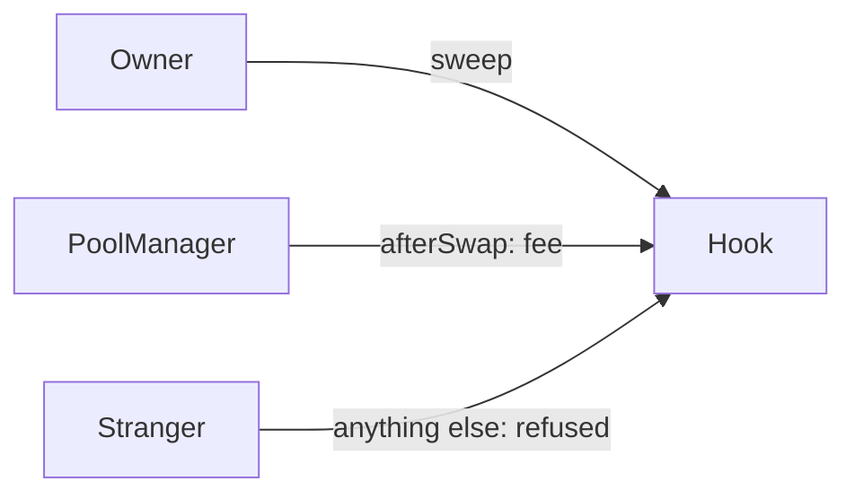

<!-- saved by the orchestrator for a subagent: round r02, a near-miss dossier written by hand for scripts/selftest.sh -->
<!-- its job: every shape a real dossier took on the way to paper, in one small file -->

# ExampleHook v0.3 - dossier for security review

**Commit / manifest:** 0a1b2c3d4e5f60718293a4b5c6d7e8f901234567 · `.gauntlet/MANIFEST.sha256`
**Not deployed. Not audited by humans.** Prepared with AI agents under the owner's direction.
**Not done: 3 of the 13 judges in section 6, 1 steps skipped with the owner's agreement · ceiling_reached: no · skeleton: 0 findings open**

## 0. Executive summary

ExampleHook charges a fee on swaps above a threshold and keeps it in the hook until the owner sweeps it. Two
adversarial rounds, two model families; no high or medium finding is open. Nothing here is still moving.

## 1. Scope sheet

| | |
|---|---|
| the exact commit | 0a1b2c3d4e5f60718293a4b5c6d7e8f901234567 |
| keccak256 of the runtime bytecode | 0x9f86d081884c7d659a2feaa0c55ad015a3bf4f1b2b0b822cd15d6c15b0f00a089f86d081884c7d659a2feaa0c55ad015 |
| files in scope | `src/ExampleHook.sol` (212 lines), `src/libraries/ExampleFeeMath.sol` (64 lines) |

## 6. What the judges said

| judge | command, tool version | result, read from the output | where the output is | evidence label |
|---|---|---|---|---|
| invariant fuzzing | `FOUNDRY_INVARIANT_RUNS=1024 FOUNDRY_INVARIANT_DEPTH=500 scripts/fuzz-long.sh foundry-kit/v4` with forge 1.8.1 | 512 000 calls, rc 0; census 1025 runs, 0 unexplained; deposit ok in 1025, withdraw 1023, sweep 1025, swapAboveThreshold 874, strangerCallsBeforeSwap 1025; gate PASSED | `.gauntlet/reports/very/deeply/nested/directory/structure/that/never/ends/fuzz-long-kitcopy-20260924T101112Z/census/long.tsv` | PROPERTY-TESTED |
| mutation | `forge test --mutate src/ExampleHook.sol --match-path 'test/unit/*|test/smoke/*|test/sim/*'` | 96 generated: 83 killed, 10 survived, 2 invalid, 1 skipped; survivors: 6 equivalent (`==0`->`<=0`, `!=0`->`>0` on uints), 4 killed by the new tests in round r02 | `.gauntlet/reports/05-mutation.txt` | MUTATION-TESTED |
| coverage | `forge coverage --report summary --no-match-coverage 'test/\|script/'` | lines 33/33, branches 10/10; no uncovered branch | `.gauntlet/reports/04-coverage.txt` | SUPPORTED |
| symbolic | not done: light mode | - | - | UNVERIFIED |

## 7. A table wider than the page

| id | round | kind | family | high | medium | low | info | changed | report | evidence | owner |
|---|---|---|---|---|---|---|---|---|---|---|---|
| r01 | 1 | audit | A | 0 | 1 | 2 | 3 | the fee rounding now favours the pool | `.gauntlet/rounds/r01/report.md` | MUTATION-TESTED | accepted by the owner on 2026-09-20 |
| r02 | 2 | black-box | B | 0 | 0 | 1 | 1 | nothing | `.gauntlet/rounds/r02/report.md` | REASONED | - |

## 9. What was NOT checked

- economic and ordering attacks (MEV, JIT liquidity) were reasoned about, not tested
- native currency paths:
  - the hook refuses them in `beforeInitialize`, tested
  - the refusal's gas was never measured, and a continuation line that belongs
    to this nested item must stay with it
    - a third level, for a dossier written by a careful agent
- nothing here was reviewed by a human with security training

1. first numbered step of the reproduction
2. second numbered step, with `forge clean` first

## 10. Reproduce it

```bash
# this is a comment inside a code block, not a heading
## neither is this
forge clean && scripts/battery.sh foundry-kit/v4 && sha256sum -c .gauntlet/MANIFEST.sha256 && echo "the manifest matches, every file in scope, and the build configuration too"
0x9f86d081884c7d659a2feaa0c55ad015a3bf4f1b2b0b822cd15d6c15b0f00a089f86d081884c7d659a2feaa0c55ad0159f86d081884c7d659a2feaa0c55ad015
```



A paragraph whose emphasis is nested wrongly, **fee *rounding** in the pool's favour*, is set as plain text, and one
+ that wraps onto a line starting with a plus sign keeps the sign.

The last paragraph, after everything else, so that a dossier that ends in prose is seen to end.
